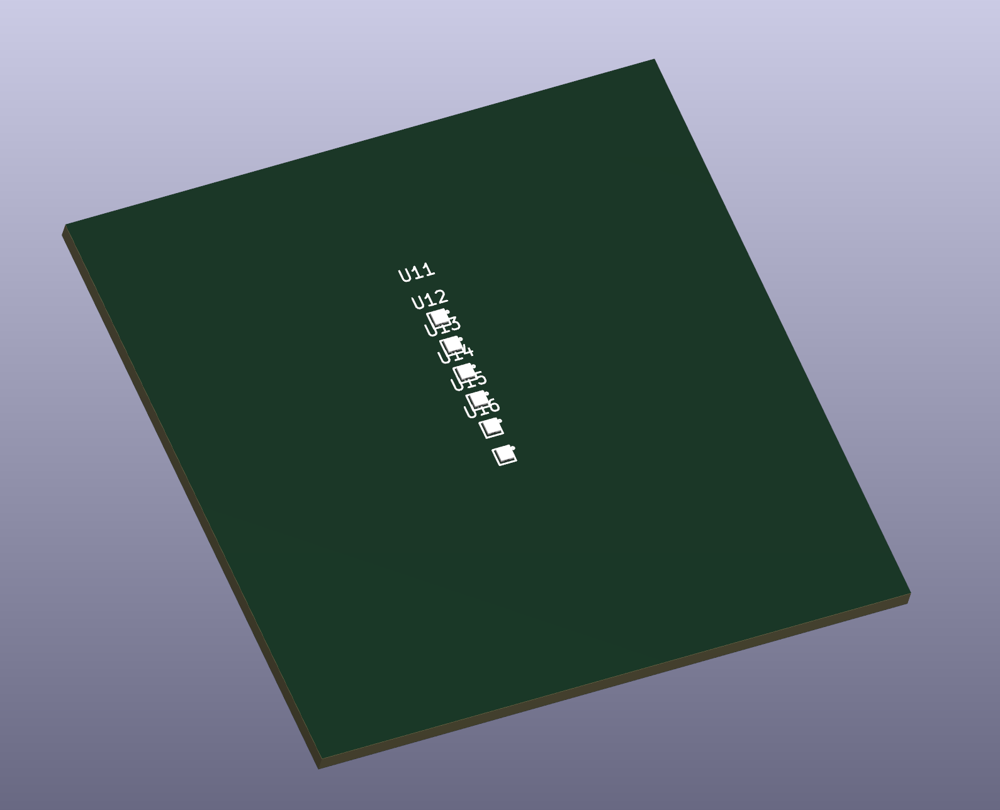
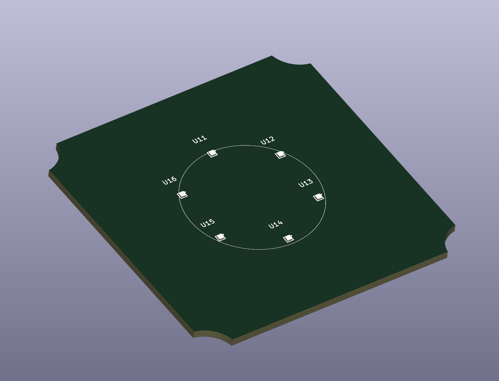
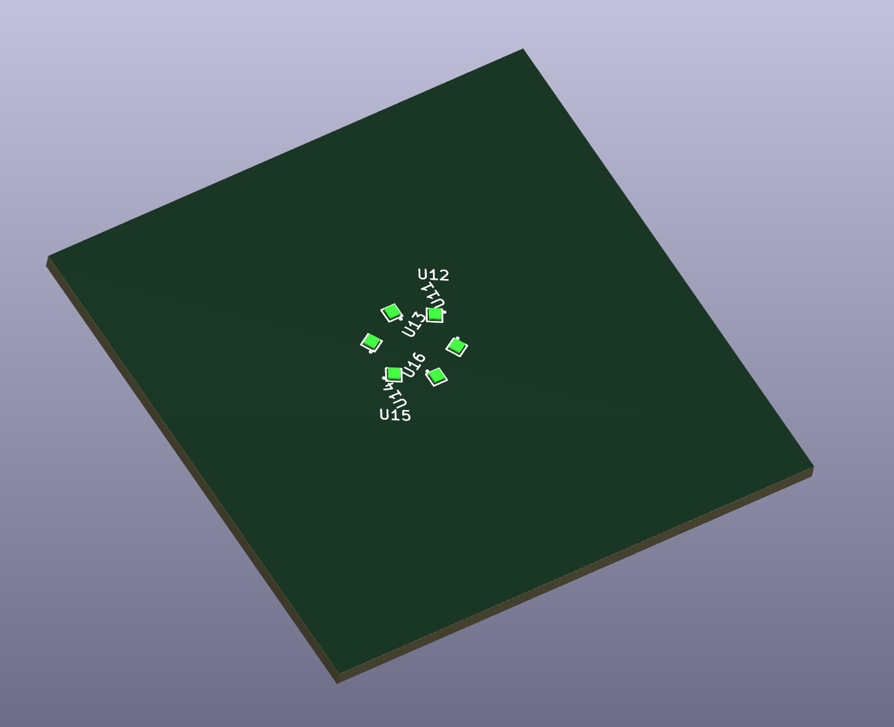
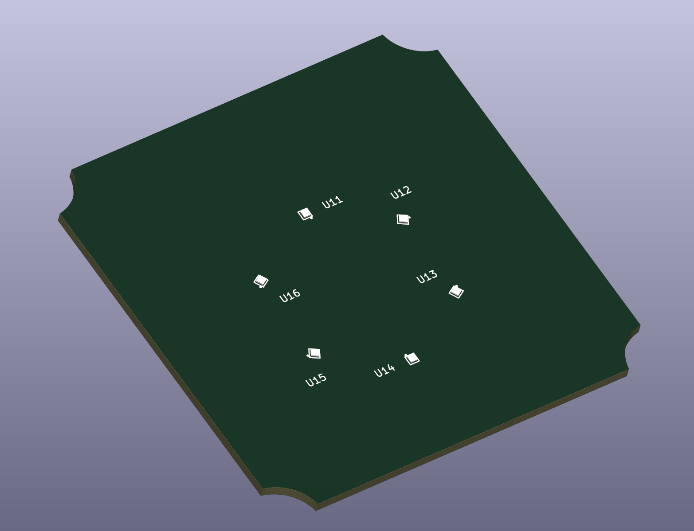

# Kicad-Tools

A collection of small KiCad tools / action plugins, installable via the
KiCad Plugin and Content Manager (PCM).

## Plugins

| Plugin | KiCad | Description |
|--------|-------|-------------|
| [Arrange In Circle](ArrangeInCircle/) | 10.0 | Place selected footprints evenly on a circle with a live preview. No duplication — schematic links stay intact. |

## Install from the PCM repository

1. In KiCad open *Tools → Plugin and Content Manager*.
2. *Manage* → *Add* and enter this repository URL:
   `https://raw.githubusercontent.com/mrred2k/Kicad-Tools/main/repository.json`
3. Pick the plugin from the list and install.

## Install from a release ZIP

1. Download the plugin ZIP from the [Releases](https://github.com/mrred2k/Kicad-Tools/releases) page.
2. In KiCad open *Tools → Plugin and Content Manager* → *Install from File...* and select the ZIP.

## Manual install (development)

Copy the plugin file into KiCad's user plugin directory:

```
Documents/KiCad/10.0/scripting/plugins/
```

then in KiCad run *Tools → External Plugins → Refresh Plugins*.

## Usage

Select the footprints in the PCB editor, then run
*Tools → External Plugins → Arrange Footprints in Circle*.
The dialog shows a live preview; each footprint is drawn as its pad
bounding box so you can see the ring, the start part and the rotation
effects before applying. Placement order is ascending by reference.

## Screenshots

Six RGB LEDs before arranging (picked from the schematic in a row):



Arranged in a circle — parts keep their original rotation:



Arranged in a circle with *Rotate parts* enabled (silkscreen rotates with
the part):



Same, plus *Keep silkscreen text upright* — labels stay readable:




## Repository layout

```
Kicad-Tools/
├── ArrangeInCircle/          # one folder per plugin (PCM package root)
│   ├── metadata.json         # package metadata (schema v2)
│   └── plugins/
│       ├── __init__.py
│       └── ArrangeInCircle.py
├── repository.json           # PCM repository descriptor
├── packages.json             # package list with download URLs/hashes
├── build_releases.py         # builds release ZIPs + updates packages.json
└── screenshots/              # per-plugin screenshots for the README
```

## Building release ZIPs

```bash
python build_releases.py
```

This creates `dist/<plugin>-<version>.zip` archives (content: `metadata.json`
plus `plugins/`, `resources/`) and updates `packages.json` with the real
SHA-256 hashes and sizes. Upload the ZIPs to a GitHub Release and commit
the updated `packages.json`.

## License

GPL-3.0 — see [LICENSE](LICENSE).
